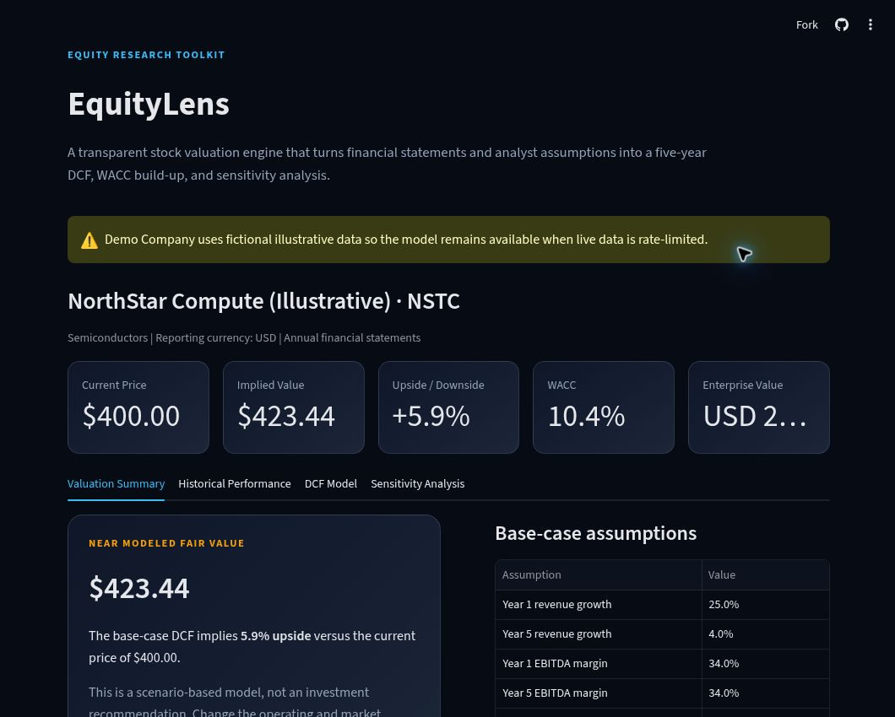
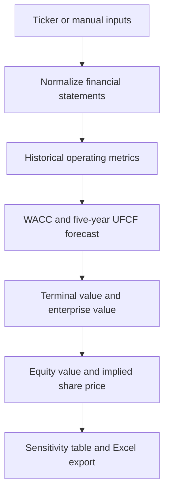

# EquityLens — Stock Valuation Engine

[](https://stock-valuation-engine-aqcw4hp5p9yec952hrpnfi.streamlit.app/)
[](https://github.com/Huniiiii/Stock-Valuation-Engine/actions/workflows/tests.yml)
[](https://www.python.org/)
[](https://streamlit.io/)

EquityLens turns a public-company ticker and analyst assumptions into an auditable five-year discounted cash flow valuation. It combines financial-statement analysis, WACC construction, scenario testing, and investment communication in one interactive application.

**[Launch the live app →](https://stock-valuation-engine-aqcw4hp5p9yec952hrpnfi.streamlit.app/)**



## At a glance

| | What EquityLens provides |
|---|---|
| **Inputs** | Live ticker data, a self-contained demo company, or manual financial inputs |
| **Historical analysis** | Revenue growth, EBITDA margin, and free cash flow |
| **Valuation model** | CAPM-based WACC, five-year UFCF forecast, and perpetual-growth DCF |
| **Outputs** | Enterprise value, equity value, implied share price, and upside/downside |
| **Risk analysis** | 5×5 WACC and terminal-growth sensitivity table |
| **Deliverable** | Multi-sheet Excel valuation workbook |

## Try it in 60 seconds

1. Open the [live demo](https://stock-valuation-engine-aqcw4hp5p9yec952hrpnfi.streamlit.app/). The fictional demo company loads immediately.
2. Change revenue growth, EBITDA margin, WACC inputs, or terminal growth in the sidebar.
3. Review the valuation bridge and sensitivity range, then download the Excel workbook.

For a real company, select **Live ticker** and enter a symbol such as `AAPL`, `MSFT`, or `NVDA`. Live data availability depends on Yahoo Finance.

## Model workflow



### Core formulas

```text
Cost of Equity = Risk-Free Rate + Beta × Equity Risk Premium

WACC = Equity Weight × Cost of Equity
     + Debt Weight × Pre-Tax Cost of Debt × (1 − Tax Rate)

UFCF = EBIT × (1 − Tax Rate) + D&A − CapEx − Change in NWC

Terminal Value = Final-Year UFCF × (1 + g) / (WACC − g)
```

The model discounts forecast UFCF and terminal value to the present, subtracts debt, adds cash, and divides by diluted shares outstanding to calculate implied value per share.

## Engineering decisions

- **Separation of concerns:** market-data retrieval, valuation logic, and presentation are isolated in separate modules.
- **Transparent assumptions:** every major operating and market input is visible and adjustable rather than hidden in code.
- **Reliable demonstration:** demo and manual modes keep the app usable when third-party data is incomplete or rate-limited.
- **Model safeguards:** the engine rejects terminal-growth assumptions that are greater than or equal to WACC.
- **Auditable output:** users can export assumptions, WACC, forecast financials, valuation summary, and sensitivity results to Excel.
- **Automated verification:** unit tests cover WACC, DCF bridge consistency, sensitivity directionality, validation, and a full Streamlit render smoke test.

## Project structure

```text
Stock-Valuation-Engine/
├── app.py                       # Streamlit UI, charts, and Excel export
├── data_provider.py             # Yahoo Finance retrieval and normalization
├── valuation_engine.py          # WACC, DCF, and sensitivity calculations
├── tests/
│   ├── test_valuation_engine.py # Finance-model unit tests
│   └── test_app_smoke.py        # End-to-end Streamlit render test
├── .github/workflows/tests.yml  # GitHub Actions CI
├── .streamlit/config.toml       # Application theme
├── requirements.txt
└── requirements-dev.txt
```

## Run locally

```bash
git clone https://github.com/Huniiiii/Stock-Valuation-Engine.git
cd Stock-Valuation-Engine

python -m venv .venv
source .venv/bin/activate       # Windows: .venv\Scripts\activate
pip install -r requirements.txt
streamlit run app.py
```

Run the test suite:

```bash
pip install -r requirements-dev.txt
pytest -q
```

## Deployment

The app is deployed on Streamlit Community Cloud from the `main` branch with `app.py` as the main module. No API key or Streamlit secret is required.

For a new deployment:

1. Connect this GitHub repository in [Streamlit Community Cloud](https://share.streamlit.io/).
2. Select branch `main` and main file `app.py`.
3. Deploy; dependencies are installed from `requirements.txt`.

## Interview discussion points

- Why a valuation range is more decision-useful than a single precise price target
- How changes in WACC and terminal growth affect enterprise value
- Why statement normalization and third-party data quality are practical modeling risks
- Why traditional unlevered DCF is less suitable for banks and insurers
- How modular design and automated tests make financial models easier to audit

## Limitations

- Third-party market data can be delayed, incomplete, or classified differently from company filings.
- Forecasts use simplified analyst assumptions and do not replace a full investment thesis or source-filing review.
- A traditional unlevered DCF is generally less appropriate for financial institutions because debt is part of operations.
- This project is for education and portfolio demonstration, not investment advice.

## Security

The project requires no API key. `.env` files and `.streamlit/secrets.toml` are ignored to prevent accidental credential commits.
