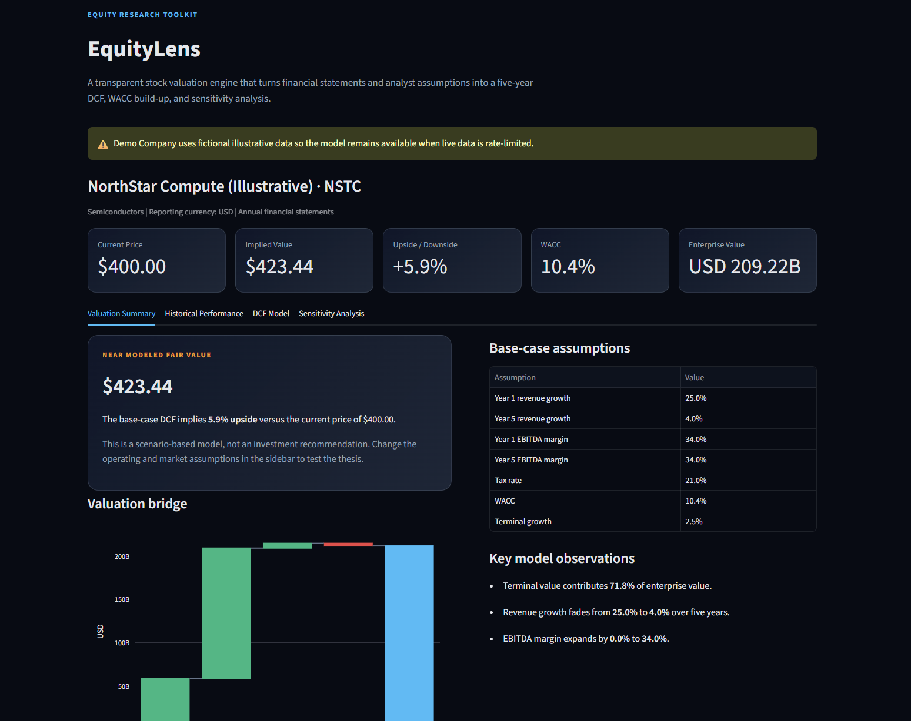

# EquityLens | Stock Valuation Engine

A Python and Streamlit application for valuing public companies with a five-year discounted cash flow model. Adjust operating assumptions and the cost of capital, compare the implied share price with the market price, and export the analysis to Excel.

[Open the app](https://stock-valuation-engine-aqcw4hp5p9yec952hrpnfi.streamlit.app/) · [Model calculations](valuation_engine.py) · [Tests](tests/)



*The screenshot uses NorthStar Compute, a fictional semiconductor company included in the app. Figures are illustrative.*

## Using the model

The app opens with a demo company so the model can be explored without downloading market data. Select **Live ticker** to load a company from Yahoo Finance, or use **Manual input** to enter financial inputs.

1. Review historical revenue, EBITDA margins, and free cash flow.
2. Set revenue growth, margins, reinvestment assumptions, and WACC inputs in the sidebar.
3. Review the DCF forecast, valuation bridge, and WACC / terminal-growth sensitivity table.
4. Download the Excel workbook with the valuation summary, historical financials, forecast, assumptions, and sensitivity results.

## Valuation approach

Revenue growth and EBITDA margins move linearly between the selected Year 1 and Year 5 assumptions. D&A and capital expenditure are modeled as percentages of revenue. Incremental working capital is a percentage of positive revenue increases; the model does not assume a working-capital release when revenue falls.

WACC combines a CAPM-based cost of equity with the after-tax cost of debt, weighted by market capitalization and debt. The model then discounts annual unlevered free cash flow and a perpetual-growth terminal value using year-end discounting.

```text
Cost of equity = Risk-free rate + Beta × Equity risk premium
WACC = Equity weight × Cost of equity
     + Debt weight × Pre-tax cost of debt × (1 − Tax rate)

Unlevered FCF = EBIT × (1 − Tax rate) + D&A − CapEx − Change in NWC
Terminal value = Year 5 FCF × (1 + Terminal growth) / (WACC − Terminal growth)

Enterprise value = PV of forecast FCF + PV of terminal value
Equity value = Enterprise value + Cash − Debt
Implied share price = Equity value / Shares outstanding
```

The 5 × 5 sensitivity table recalculates implied share prices at different WACC and terminal-growth assumptions. Cases where terminal growth is at least as high as WACC are excluded.

## Data and limitations

Live mode retrieves annual statements and market data through `yfinance`. It maps available statement fields and estimates some missing values, such as EBITDA from EBIT plus D&A. These inputs still need to be checked against company filings, particularly for one-off items and differences in reporting periods.

- Valuation depends heavily on the forecast assumptions and terminal value. The sensitivity table shows how the result changes; it is not a statistical confidence interval.
- Market data may be delayed, incomplete, or temporarily unavailable. Some missing inputs use defaults that should be reviewed before interpreting the result.
- The live risk-free-rate input uses a US Treasury yield proxy. Currency and rate assumptions need to be consistent when valuing non-US companies.
- The enterprise-to-equity bridge includes cash and debt but does not separately adjust for minority interests, preferred stock, or other claims.
- The model is intended for non-financial operating companies. Banks and insurers generally require a different valuation approach.

This is a personal financial-modeling project, not an investment recommendation.

## Code and tests

| File | Purpose |
| --- | --- |
| `app.py` | Streamlit interface, charts, and Excel export |
| `data_provider.py` | Market-data retrieval, statement-field mapping, and demo data |
| `valuation_engine.py` | WACC, cash-flow forecasts, DCF, and sensitivity calculations |
| `tests/test_valuation_engine.py` | Calculation, validation, and sensitivity tests |
| `tests/test_app_smoke.py` | Checks that the default demo page renders without errors |

The calculation functions are separate from the interface and data provider, so they can be tested without downloading live data. GitHub Actions runs the test suite.

## Run locally

```bash
git clone https://github.com/Huniiiii/Stock-Valuation-Engine.git
cd Stock-Valuation-Engine
python -m venv .venv
source .venv/bin/activate
pip install -r requirements.txt
streamlit run app.py
```

On Windows, activate the environment with `.venv\Scripts\activate` instead.

To run the tests:

```bash
pip install -r requirements-dev.txt
pytest -q
```

The hosted app runs on Streamlit Community Cloud using `app.py`. No API key is required.
